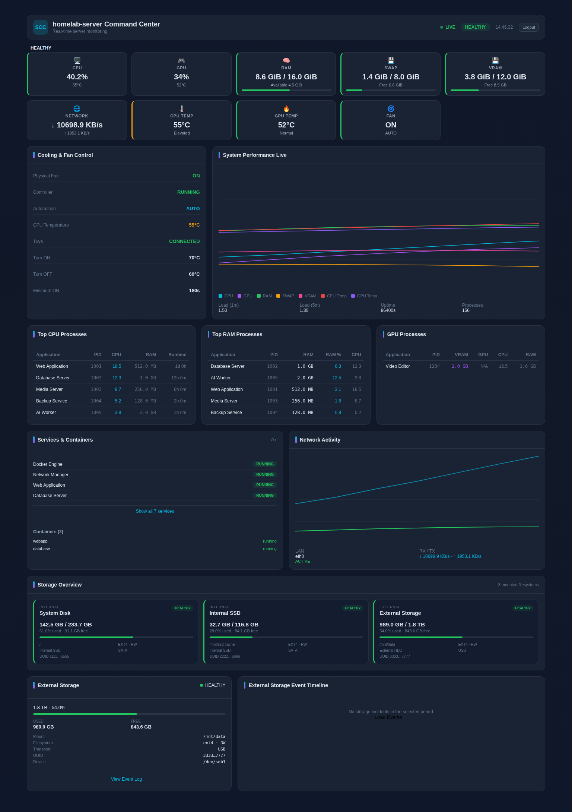

# Server Command Center

A lightweight, self-hosted web dashboard for real-time Linux server monitoring. It combines a compact Beszel-style overview, GPU-focused telemetry, process visibility, service/container health, storage monitoring, and read-only fan-controller observation in one responsive interface.



## Highlights

- CPU load, per-core load, temperature, frequency and load average
- NVIDIA GPU utilization, temperature, VRAM, clocks, and GPU process VRAM
- RAM **and Swap** used / total / available-free
- Network RX/TX, active LAN/Wi-Fi route and failover visibility
- Top CPU and RAM processes with PID and friendly application names
- systemd services and Docker container status
- **All mounted storage** with internal/external classification, model, usage, filesystem and UUID
- Optional UUID-tracked external storage incident log with disconnect/reconnect history
- Read-only observation of an existing fan controller
- Responsive dark glass UI with static Vite/React frontend
- FastAPI backend with one shared collector loop and WebSocket fan-out
- Built-in login using PBKDF2 password hashes and an HTTP-only signed session cookie
- Secret redaction for process arguments and forensic logs

## Architecture

```text
Browser
  │
  ├── HTTPS / reverse proxy
  │
FastAPI :18680
  ├── static React/Vite frontend
  ├── /api/* REST endpoints
  ├── /ws/metrics WebSocket
  │
  └── shared collector hub
       ├── CPU / RAM / Swap
       ├── GPU / VRAM
       ├── processes
       ├── network
       ├── systemd services
       ├── Docker
       ├── mounted storage
       ├── UUID-tracked external storage
       └── fan-controller observer
```

The browser never samples the host directly. One backend collector loop samples the server and broadcasts sanitized snapshots to all connected clients.

## Requirements

- Linux
- Python 3.11+
- Node.js / npm for building the frontend
- `nvidia-smi` for NVIDIA GPU telemetry (optional)
- Docker CLI for container telemetry (optional)
- systemd for service telemetry (optional)

## Quick start

### 1. Clone

```bash
git clone https://github.com/aicoach-alpha/server-command-center.git
cd server-command-center
```

### 2. Backend

```bash
python3 -m venv backend/.venv
backend/.venv/bin/pip install -r backend/requirements.txt
```

### 3. Configure authentication

Authentication is enabled by default and fails closed until credentials are configured.

Generate an auth environment file:

```bash
python3 scripts/setup-auth.py
```

The default output is:

```text
~/.config/server-command-center/auth.env
```

Keep this file private (`0600`) and do **not** commit it.

### 4. Optional external-storage tracking

General storage discovery automatically shows mounted filesystems. For disconnect/reconnect incident tracking of one important external volume, add to the auth/environment file:

```ini
SCC_EXTERNAL_STORAGE_UUID=11111111-2222-3333-4444-555555555555
SCC_EXTERNAL_STORAGE_MOUNTPOINT=/mnt/data
SCC_EXTERNAL_STORAGE_NAME=External Storage
```

The UUID is authoritative; `/dev/sdX` is treated only as transient telemetry.

### 5. Frontend

```bash
cd frontend
npm install
npm run build
cd ..
```

Vite exports the production frontend into `./dist`, which FastAPI serves directly.

### 6. Run

```bash
set -a
source ~/.config/server-command-center/auth.env
set +a

cd backend
.venv/bin/python -m uvicorn app.main:app --host 127.0.0.1 --port 18680
```

Open `http://127.0.0.1:18680`.

For LAN/reverse-proxy deployments you may bind to `0.0.0.0`, but only do this behind an authenticated/private network path.

## Reverse proxy

The dashboard uses WebSockets. Your reverse proxy must forward WebSocket Upgrade headers for:

```text
/ws/metrics
```

Recommended public path:

```text
Internet
  ↓ HTTPS
Cloudflare / reverse proxy
  ↓
Server Command Center
```

Do not port-forward the application directly from your router to the Internet.

## Authentication

The built-in login uses:

- PBKDF2-SHA256 password hashing
- HMAC-SHA256 signed expiring sessions
- HTTP-only cookies
- SameSite=Lax cookies
- automatic Secure cookies when HTTPS is detected
- per-client login-attempt throttling

Environment variables:

```ini
SCC_AUTH_ENABLED=true
SCC_AUTH_USERNAME=admin
SCC_AUTH_PASSWORD_HASH=...
SCC_SESSION_SECRET=...
SCC_AUTH_SESSION_TTL_S=43200
```

## Storage

The Storage Overview automatically discovers mounted real filesystems and reports:

- internal vs external
- mountpoint
- device / parent block device
- model
- transport
- filesystem
- read-only state
- UUID / label
- total / used / free
- health based on configured disk thresholds

Loop, squashfs, tmpfs, Docker overlay and other virtual filesystems are filtered from the main storage cards.

## GPU limitations

Some older NVIDIA drivers do not expose per-process GPU utilization. In that case SCC reports that field as **N/A** rather than inventing zero, while per-process VRAM can still be displayed when available.

## Fan controller

SCC intentionally treats fan automation as read-only. It can observe an existing controller service and status, but it does not expose local device keys or directly actuate the fan.

## Configuration

See `backend/.env.example` for sampling intervals, health thresholds, authentication and external-storage settings.

## Tests

Backend:

```bash
cd backend
.venv/bin/pytest -q
```

Frontend:

```bash
cd frontend
npm test
npx tsc --noEmit
npm run build
```

## Security

Before publishing or deploying:

- never commit `.env` files, session secrets, API keys, local device keys or passwords
- use HTTPS for public access
- keep the application behind a reverse proxy or private network
- review process metadata before exposing the dashboard to untrusted users

See [SECURITY.md](SECURITY.md).

## License

MIT. See [LICENSE](LICENSE).
